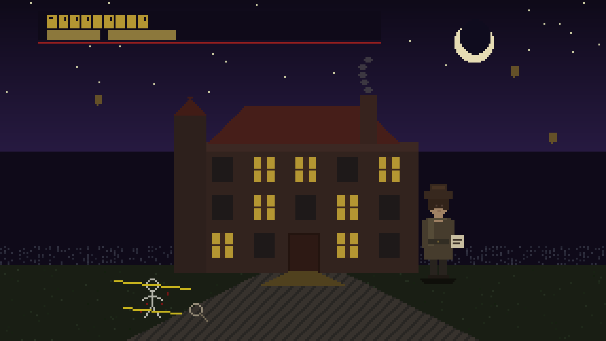

# 🕵️ Detective Agentic Mysteries



**A 2D AI-powered detective game where every NPC is an independent AI agent.**

Built entirely with [GitHub Copilot CLI](https://docs.github.com/en/copilot), this project demonstrates how the Copilot SDK can orchestrate multiple AI agents — each with its own memory, personality, emotional state, and tools — into a cohesive, emergent experience. Every playthrough is unique because the AI agents make real decisions, not scripted ones.

> **Why this matters:** The multi-agent architecture powering this game is the same pattern that platform engineers can use to orchestrate incidents, manage infrastructure, and automate complex workflows. See [Beyond Games: Platform Engineering Applications](#-beyond-games-platform-engineering-applications) below.

---

## 🎮 What You Get

- **9+ AI suspects** with unique personalities, secrets, alibis, and emotional states
- **An AI Director** that orchestrates the world between days — moving NPCs, planting evidence, escalating drama
- **An AI Forensics Analyst** that provides scientific analysis of collected evidence
- **An AI Narrator** that generates atmospheric noir prose in real-time
- **An AI Profiler** that studies how *you* play and adapts NPC responses accordingly
- **Procedurally generated mysteries** — a "Skeleton Key" agent can generate entirely new settings, characters, and crimes
- **Day/night cycles** where NPCs have private conversations, form alliances, and betray each other
- **Multiple levels** — Victorian manor and cruise ship, plus randomly generated scenarios

---

## 📋 Prerequisites

### 1. GitHub Copilot CLI (Required)

This game runs on top of the **GitHub Copilot CLI agent**, which provides the AI runtime. You need:

- **A GitHub account** with an active **Copilot subscription** (Individual, Business, or Enterprise)
- **GitHub Copilot CLI** installed and authenticated:

```bash
# Install GitHub CLI if you don't have it
# macOS
brew install gh

# Windows
winget install GitHub.cli

# Linux
# See https://github.com/cli/cli/blob/trunk/docs/install_linux.md

# Authenticate with GitHub
gh auth login

# Install the Copilot CLI extension
gh extension install github/gh-copilot
```

### 2. Node.js

- **Node.js 18+** (we recommend the latest LTS)

```bash
node --version  # Should be 18.x or higher
```

### 3. npm (comes with Node.js)

---

## 🚀 Quick Start

 [](https://codespaces.new/suuus/detective-agentic-mysteries)

Open in a codespace and npm run dev, or install it locally per instructions below:

```bash
# Clone the repo
git clone https://github.com/suuus/detective-agentic-mysteries.git
cd detective-agentic-mysteries

# Install dependencies
npm install

# Start the game server (launches Copilot SDK automatically)
npm run dev

# Open your browser
# → http://localhost:3000
```

The server starts on port 3000. The Copilot SDK client connects automatically and creates AI sessions for each agent. You'll see logs like:

```
✅ Copilot SDK client connected
🕵️  Detective Agentic Mysteries running on http://localhost:3000
```

---

## 🏗️ Architecture

### The Multi-Agent System

This game runs **9+ concurrent AI agents**, each as an independent Copilot SDK session with its own system prompt, tools, and conversation history:

```
┌─────────────────────────────────────────────────────────────────┐
│                        Express Server                           │
│                    (Orchestration Layer)                         │
│                                                                 │
│  ┌──────────┐ ┌──────────┐ ┌──────────┐ ┌──────────┐          │
│  │ Victoria │ │ Hartwell │ │  Clara   │ │  Price   │  ...NPCs  │
│  │ (suspect)│ │ (killer) │ │(suspect) │ │(suspect) │          │
│  └────┬─────┘ └────┬─────┘ └────┬─────┘ └────┬─────┘          │
│       │             │             │             │               │
│       └─────────────┴──────┬──────┴─────────────┘               │
│                            │                                    │
│  ┌──────────┐  ┌───────────┴──┐  ┌───────────┐  ┌───────────┐ │
│  │ Director │  │  Forensics   │  │ Narrator  │  │ Profiler  │ │
│  │ (plans   │  │  (evidence   │  │ (prose    │  │ (player   │ │
│  │  nights) │  │   analysis)  │  │  gen)     │  │  analysis)│ │
│  └──────────┘  └──────────────┘  └───────────┘  └───────────┘ │
│                                                                 │
│  ┌──────────────┐  ┌────────────────┐                          │
│  │ Skeleton Key │  │  Red Herring   │                          │
│  │ (mystery gen)│  │  (dynamic NPC) │                          │
│  └──────────────┘  └────────────────┘                          │
└─────────────────────────────────────────────────────────────────┘
```

| Agent | Session ID | Role | Tools |
|-------|-----------|------|-------|
| **5 NPC Suspects** | `blackwood-{name}` | Interrogatable characters with personalities, secrets, emotional states | `check_evidence_shown`, `reveal_clue`, `update_sentiment`, `get_my_sentiment`, `show_body_language`, `create_evidence`, `get_detective_profile`, `get_overheard_info`, `gossip_about_detective` |
| **Director** | `blackwood-director` | Plans nights: who talks to whom, NPC movement, evidence changes, panic events | `get_full_game_state`, `get_conversation_history`, `submit_night_plan`, `trigger_panic_event`, `form_alliance`, `tamper_evidence` |
| **Forensics** | `blackwood-forensics` | Analyzes evidence items with scientific reasoning | *(none — pure analysis)* |
| **Narrator** | `blackwood-narrator` | Generates atmospheric noir prose for events | `emit_narration` |
| **Profiler** | `blackwood-profiler` | Studies the player's interrogation style and adapts NPC behavior | `update_detective_profile` |
| **Skeleton Key** | *(on-demand)* | Generates entirely new mysteries, characters, evidence, and settings | *(generation only)* |
| **Red Herring** | `blackwood-{dynamic}` | Dynamically created suspect to mislead the player | Same as NPC suspects |

### How Agents Communicate

Agents don't talk directly to each other. The **Express server acts as the orchestration layer**, mediating all inter-agent communication through three patterns:

#### 1. Tool-Mediated State Changes
NPCs call tools (e.g., `update_sentiment`, `create_evidence`) that modify shared game state. Other agents read this state through their own tools. This is indirect communication — agents influence each other through a shared world.

```
NPC A calls update_sentiment("scared") → Game State updates →
NPC B calls get_overheard_info() → learns A is scared
```

#### 2. `onPostToolUse` Hooks (Reactive Side Effects)
The Copilot SDK's `SessionHooks` allow registering lifecycle callbacks that fire after every tool call. We use `onPostToolUse` to propagate side effects automatically — during **both** player interrogations and night conversations:

```typescript
const session = await client.createSession({
  sessionId: "blackwood-hartwell",
  tools: gameTools,
  hooks: {
    onPostToolUse: async (input, { sessionId }) => {
      const characterId = sessionId.replace("blackwood-", "");
      switch (input.toolName) {
        case "update_sentiment":
          // Emotional shifts are noticed by nearby NPCs
          if (input.toolArgs.emotional_state === "desperate") {
            for (const npc of otherNPCs)
              gameState.addEavesdrop(npc.id, `${name} appears desperate`);
          }
          break;
        case "reveal_clue":
          // High-importance clues are overheard by nearby NPCs
          break;
        case "show_body_language":
          // Visible actions are noticed by others in the room
          break;
      }
    },
  },
});
```

This replaces manual eavesdropping wiring and ensures side effects fire consistently regardless of context. The hook receives the tool name, arguments, and result — enabling reactive cross-agent behavior without tight coupling.

#### 3. Server-Orchestrated Conversations (Night Phase)
The server takes NPC A's response, injects it as context into NPC B's prompt, and vice versa. Each night conversation is 4 exchanges (2 rounds of back-and-forth):

```
Server → NPC A: "You encounter NPC B in the garden..."
NPC A responds → Server captures response
Server → NPC B: "NPC A just said: '{response}'..."
NPC B responds → Server captures response
(repeat for round 2)
```

#### 4. Fire-and-Forget Broadcasting
After a player interrogates an NPC, the server broadcasts gossip to all other NPCs, profiles the player's style, and checks for contradictions — all asynchronously:

```
Player interrogates Victoria →
  ├── spreadGossip() → all other NPCs hear what was asked
  ├── profileDetective() → Profiler analyzes question style
  └── analyzeContradictions() → Forensics checks for NPC inconsistencies
```

### Session Health & Recovery

AI sessions can stall or crash. The system auto-recovers:

- **`talkWithRetry()`** — 2 attempts with `session.abort()` between failures
- **Active request tracking** — every `sendAndWait` is tracked with a timestamp
- **30s healthcheck** — detects sessions stuck >50s, aborts and recreates them
- **`sendAndCollect()`** (night conversations) — also tracks and auto-recovers

### Tech Stack

| Layer | Technology |
|-------|-----------|
| **AI Runtime** | `@github/copilot-sdk` — `CopilotClient` creates sessions per agent |
| **Backend** | Express.js — serves static files + API routes |
| **Frontend** | Phaser 3 (CDN) — 2D game engine, vanilla JS modules |
| **Execution** | `tsx` — runs TypeScript directly, no build step |
| **Package type** | ES modules (`"type": "module"`) |

---

## 🔧 How We Built This

This entire game was built using **GitHub Copilot CLI** as the primary development tool. Here's what made the Copilot SDK uniquely suited for this:

### The Key Insight: Sessions Are Agents

The Copilot SDK's `createSession()` isn't just a chat API — it's an agent factory. Each session gets:
- A **system prompt** that defines its identity and knowledge
- **Tools** that let it take actions in the world
- **Conversation history** that persists across messages (memory)
- **Streaming** for real-time response delivery

```typescript
const session = await client.createSession({
  sessionId: "blackwood-hartwell",
  model: "gpt-4.1",
  streaming: true,
  tools: gameTools,
  onPermissionRequest: approveAll,
  infiniteSessions: { enabled: false },
  systemMessage: {
    mode: "replace",
    content: characterSystemPrompt  // Who they are, what they know, how they behave
  },
});
```

### Design Decisions

1. **`systemMessage: { mode: "replace" }`** — Each agent gets its full identity injected as the system message, not appended to a default. This means the AI fully embodies the character.

2. **Tools as agency** — NPCs don't just respond to questions. They can *act*: update their emotions, create physical evidence, express body language, gossip about the detective. This makes them feel alive.

3. **The Director pattern** — Instead of scripting game events, we created an AI agent whose entire job is to *orchestrate other agents*. It reads game state through tools, decides what happens next, and submits a structured plan. The server then executes that plan.

4. **Server as orchestrator, not participant** — The Express server never generates content. It routes messages between agents, manages session lifecycle, and applies game rules. The AI agents make all creative decisions.

5. **Fire-and-forget side effects** — After every player action, multiple background processes run: gossip spreading, player profiling, contradiction detection. These create emergent complexity without blocking the main interaction.

6. **Hooks for reactive behavior** — The SDK's `onPostToolUse` hook fires after every tool call, enabling automatic side effects (emotional shift propagation, clue eavesdropping, body language observation) without manual wiring. This means the same reactive behaviors work during both player interrogations and NPC night conversations.

7. **Resilience over correctness** — Sessions crash, responses stall, agents hallucinate. The health system (`talkWithRetry`, stuck detection, auto-recreation) ensures the game keeps running. A recovered session loses its conversation history but keeps its identity.

### The Development Loop

Building with Copilot CLI followed this pattern:
1. **Describe what you want** — "Create an NPC that acts as the killer but deflects suspicion"
2. **Copilot generates the system prompt + tools** — the character definition, tool handlers, API routes
3. **Playtest** — interact with the agent, see how it behaves
4. **Iterate on the prompt** — "Make Hartwell more nervous when shown the prescription pad"
5. **Add mechanics** — sentiment system, gossip, profiling, night conversations

The game's complexity emerged from composing simple agent patterns, not from writing complex game logic.

---

## 🏭 Beyond Games: Platform Engineering Applications

The multi-agent architecture in this game maps directly to real-world platform engineering challenges. The patterns we used — independent agents with specialized tools, a director/orchestrator, server-mediated communication, health monitoring, and auto-recovery — are exactly what's needed for complex operational systems.

### The Parallels

| Game Concept | Platform Engineering Equivalent |
|---|---|
| **NPC Agent** (personality + tools + memory) | **Service Agent** (runbook + APIs + incident context) |
| **Director Agent** (orchestrates nights) | **Incident Commander Agent** (orchestrates response) |
| **Forensics Agent** (analyzes evidence) | **Root Cause Analysis Agent** (analyzes logs/metrics) |
| **Profiler Agent** (studies player behavior) | **SRE Agent** (studies system behavior patterns) |
| **Game State** (shared truth) | **Platform State** (CMDB, service catalog, metrics) |
| **Gossip System** (NPCs share info) | **Alert Correlation** (services share context) |
| **Night Conversations** (NPC-to-NPC) | **Cross-team Coordination** (agent-to-agent handoff) |
| **Health System** (stuck detection, auto-recovery) | **Agent Supervision** (watchdog, circuit breakers) |
| **`onPostToolUse` Hooks** (reactive side effects) | **Event-Driven Automation** (post-action triggers, audit trails) |

### Concrete Use Cases

#### 🚨 Incident Response Orchestration

Replace "murder mystery" with "production incident." Each agent owns a domain:

```
┌─────────────────────────────────────────────────────┐
│              Incident Commander Agent                │
│  (reads all signals, coordinates response)           │
│                                                      │
│  ┌────────────┐ ┌────────────┐ ┌────────────┐      │
│  │ Database   │ │ Networking │ │ App Layer  │      │
│  │ Agent      │ │ Agent      │ │ Agent      │ ...  │
│  │            │ │            │ │            │      │
│  │ Tools:     │ │ Tools:     │ │ Tools:     │      │
│  │ query_logs │ │ check_dns  │ │ get_traces │      │
│  │ run_diag   │ │ trace_route│ │ check_deps │      │
│  │ failover   │ │ update_lb  │ │ rollback   │      │
│  └────────────┘ └────────────┘ └────────────┘      │
└─────────────────────────────────────────────────────┘
```

- **Database Agent** has tools to query slow query logs, check replication lag, trigger failover
- **Networking Agent** has tools to run traceroutes, check DNS, update load balancers
- **App Agent** has tools to pull distributed traces, check dependency health, trigger rollbacks
- **Incident Commander** reads all agent findings (like the Director reading game state), synthesizes a response plan, and coordinates execution

The same `sendAndWait` + tools pattern that lets NPCs interrogate each other lets infrastructure agents share findings and coordinate actions.

#### 🔄 Change Management & Deployment

```
Director Agent: "Analyze the deployment plan, check all service dependencies,
                and submit your rollout strategy using the submit_deployment_plan tool."

Service Agents: Each checks its own health, dependencies, and readiness.
                Reports back through tools.

Director: Sequences the rollout, handles failures, coordinates rollbacks.
```

#### 📊 Platform Self-Service

Give teams their own agents (like NPC suspects) that understand their services:

- **"What's the status of the payment service?"** → Payment Agent checks metrics, recent deploys, open incidents
- **"Why is latency high?"** → Agent investigates, correlates with recent changes, suggests fixes
- **"Scale up the worker pool"** → Agent validates the request, checks quotas, executes safely

#### 🔍 Continuous Compliance & Auditing

The **Profiler pattern** (studying detective behavior) becomes a compliance agent that studies infrastructure changes and flags violations — not through rigid rules, but through contextual understanding of *why* a change was made and whether it matches organizational policies.

#### 🪝 Event-Driven Automation with Hooks

The `onPostToolUse` hook pattern from this game — where every NPC tool call triggers automatic side effects — maps directly to **event-driven platform automation**:

```typescript
const infraAgent = await client.createSession({
  tools: infraTools,
  hooks: {
    onPostToolUse: async (input, { sessionId }) => {
      // After any agent action, trigger cross-cutting concerns
      switch (input.toolName) {
        case "trigger_failover":
          // Auto-notify the incident commander
          // Auto-update the status page
          // Auto-log to audit trail
          break;
        case "scale_service":
          // Auto-check budget impact
          // Auto-validate against quotas
          // Auto-notify the team channel
          break;
        case "deploy_release":
          // Auto-trigger canary analysis
          // Auto-register rollback point
          break;
      }
    },
  },
});
```

This eliminates manual wiring of post-action triggers. Every agent action automatically produces audit logs, notifications, and cascading effects — without the agent itself needing to know about them. The hook runs at the SDK level, so it works whether the action was triggered by a human operator, another agent, or an automated schedule.

### Why This Architecture Works for Platform Engineering

1. **Agent isolation** — Each agent owns its domain. A database agent doesn't need to understand networking. Agents can be updated independently.

2. **Tool-mediated safety** — Agents can only do what their tools allow. A monitoring agent can read metrics but can't modify infrastructure. A deployment agent can roll back but can't access secrets. Permissions are baked into the tool definitions.

3. **Orchestrator pattern** — Complex workflows (incident response, multi-service deployments) need a coordinator that can read the full picture and make decisions. The Director agent pattern solves this.

4. **Resilience is built in** — The health check + auto-recovery pattern from this game (`talkWithRetry`, stuck detection, session recreation) is exactly what production agent systems need. Agents will fail. The system must recover gracefully.

5. **Emergent behavior** — Just as NPC conversations create unexpected plot developments, agent-to-agent communication in platform engineering can surface insights no single agent would find alone: "The database agent reports increased connection timeouts at the same time the networking agent detected a BGP route change."

6. **Hooks for cross-cutting concerns** — The `onPostToolUse` pattern separates *what agents do* from *what happens as a result*. Agents focus on their domain; hooks handle audit logging, notification, compliance checks, and cascading effects. This is the agent equivalent of middleware or aspect-oriented programming.

7. **Human-in-the-loop** — The detective (player) decides when to act on information. In platform engineering, the operator reviews agent recommendations before executing. The architecture supports both autonomous and supervised modes.

### Getting Started with Your Own Agent System

The patterns from this game are reusable:

```typescript
// 1. Define agent identity (system prompt)
const dbAgentPrompt = `You are the Database Operations Agent.
You monitor PostgreSQL clusters and respond to incidents...`;

// 2. Define agent capabilities (tools)
const dbTools = [
  defineTool("check_replication_lag", { ... }),
  defineTool("query_slow_log", { ... }),
  defineTool("trigger_failover", { ... }),
];

// 3. Create agent session with hooks for cross-cutting concerns
const dbAgent = await client.createSession({
  sessionId: "platform-db-agent",
  model: "gpt-4.1",
  tools: dbTools,
  systemMessage: { mode: "replace", content: dbAgentPrompt },
  hooks: {
    onPostToolUse: async (input) => {
      // Every tool call automatically logged, audited, and broadcast
      auditLog.record(input.toolName, input.toolArgs, input.toolResult);
      if (input.toolName === "trigger_failover") {
        await notifyIncidentChannel("Failover triggered by DB agent");
      }
    },
  },
});

// 4. Orchestrate (same pattern as Director)
const findings = await dbAgent.sendAndWait({
  prompt: "Investigate the current replication lag spike. Check the slow query log for the last 30 minutes."
});
```

The leap from "game NPC" to "platform agent" is smaller than you think — it's the same SDK, the same patterns, just different tools and prompts.

---

## 📁 Project Structure

```
├── server.ts                    # Express server + Copilot SDK session management
├── src/
│   ├── characters/              # NPC definitions (one file per character)
│   │   ├── types.ts             # CharacterDefinition interface
│   │   ├── index.ts             # Exports characters array + getCharacter()
│   │   ├── victoria.ts          # Lady Victoria
│   │   ├── hartwell.ts          # Dr. Hartwell (the killer)
│   │   ├── clara.ts             # Clara Blackwood
│   │   ├── price.ts             # Mr. Price
│   │   └── agnes.ts             # Mrs. Whitfield
│   ├── characters/cruise/       # Cruise ship level characters
│   ├── levels/                  # Level configurations
│   ├── director.ts              # AI Director agent + tools
│   ├── narrator.ts              # AI Narrator agent
│   ├── profiler.ts              # AI Profiler agent (detective behavior)
│   ├── mystery-generator.ts     # Procedural mystery generation
│   ├── gameState.ts             # Game state, evidence, sentiments, accusation logic
│   └── tools.ts                 # Copilot SDK tools for NPC agents
├── public/
│   ├── index.html               # Game page with all UI panels
│   ├── css/style.css            # Noir theme (CSS variables for re-theming)
│   └── js/
│       ├── main.js              # Phaser init, HUD, accusation modal
│       ├── api.js               # GameAPI class (all backend calls)
│       ├── dialog.js            # DialogManager (chat UI, streaming)
│       ├── inventory.js         # InventoryManager (evidence, notebook)
│       └── scenes/
│           ├── BootScene.js     # Procedural sprite generation
│           ├── ManorScene.js    # Game world (rooms, physics, NPCs)
│           └── UIScene.js       # HUD overlay scene
├── docs/
│   ├── npc-design-guide.md      # NPC prompts, sentiment, Director, new levels
│   ├── game-architecture.md     # Full game mechanics, UI, map system
│   └── level2-cruise-ship.md    # Cruise ship level design
├── AGENTS.md                    # Developer quick reference
└── package.json
```

---

## 📖 Documentation

| Document | What It Covers |
|----------|---------------|
| [`docs/npc-design-guide.md`](docs/npc-design-guide.md) | Character prompts, game rules, sentiment system, Director agent, building new levels |
| [`docs/game-architecture.md`](docs/game-architecture.md) | Phaser scenes, map system, day/night cycle, accusation system, full API reference |
| [`docs/level2-cruise-ship.md`](docs/level2-cruise-ship.md) | Cruise ship level design |
| [`AGENTS.md`](AGENTS.md) | Developer quick reference for coding sessions |

---

## 🤝 Contributing

Contributions are welcome! This project is an example of what's possible with the Copilot SDK's multi-agent capabilities. Areas where contributions would be especially valuable:

- **New mystery levels** — follow the guide in `docs/npc-design-guide.md`
- **New agent types** — forensic specialists, witness agents, media reporter agents
- **UI improvements** — the Phaser frontend is vanilla JS, lots of room for polish
- **Platform engineering examples** — ports of this architecture to real ops use cases

---

## 📄 License

[MIT](LICENSE)
